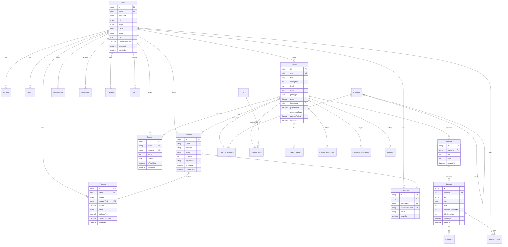

# Database Schema - EAD Platform

## Diagrama de Relacionamento Entidade (ERD)



## Tabelas Principais

### 1. Usuários e Autenticação

#### users
```sql
CREATE TABLE users (
    id VARCHAR(25) PRIMARY KEY,
    email VARCHAR(255) UNIQUE NOT NULL,
    email_verified TIMESTAMP,
    name VARCHAR(255),
    image VARCHAR(500),
    password VARCHAR(255),

    -- Perfil
    role VARCHAR(20) DEFAULT 'STUDENT' CHECK (role IN ('STUDENT', 'INSTRUCTOR', 'ADMIN')),
    status VARCHAR(30) DEFAULT 'ACTIVE' CHECK (status IN ('ACTIVE', 'SUSPENDED', 'BANNED', 'PENDING_VERIFICATION')),
    bio TEXT,
    headline VARCHAR(255),
    website VARCHAR(255),

    -- Instrutor
    instructor_bio TEXT,
    instructor_approved BOOLEAN DEFAULT FALSE,
    instructor_applied_at TIMESTAMP,
    commission_rate DECIMAL(3,2) DEFAULT 0.70,

    -- Timestamps
    created_at TIMESTAMP DEFAULT NOW(),
    updated_at TIMESTAMP DEFAULT NOW(),
    last_login_at TIMESTAMP
);

CREATE INDEX idx_users_email ON users(email);
CREATE INDEX idx_users_role_status ON users(role, status);
```

#### accounts (NextAuth.js)
```sql
CREATE TABLE accounts (
    id VARCHAR(25) PRIMARY KEY,
    user_id VARCHAR(25) NOT NULL REFERENCES users(id) ON DELETE CASCADE,
    type VARCHAR(50) NOT NULL,
    provider VARCHAR(50) NOT NULL,
    provider_account_id VARCHAR(255) NOT NULL,
    refresh_token TEXT,
    access_token TEXT,
    expires_at INTEGER,
    token_type VARCHAR(50),
    scope VARCHAR(255),
    id_token TEXT,
    session_state VARCHAR(255),

    UNIQUE(provider, provider_account_id)
);
```

### 2. Cursos e Conteúdo

#### courses
```sql
CREATE TABLE courses (
    id VARCHAR(25) PRIMARY KEY,
    slug VARCHAR(255) UNIQUE NOT NULL,

    -- Metadados
    title VARCHAR(255) NOT NULL,
    subtitle VARCHAR(500),
    description TEXT NOT NULL,
    language VARCHAR(10) DEFAULT 'pt-BR',
    level VARCHAR(20) DEFAULT 'BEGINNER' CHECK (level IN ('BEGINNER', 'INTERMEDIATE', 'ADVANCED', 'ALL_LEVELS')),

    -- Mídia
    thumbnail_url VARCHAR(500),
    promo_video_url VARCHAR(500),

    -- Pricing
    price_type VARCHAR(20) DEFAULT 'PAID' CHECK (price_type IN ('FREE', 'PAID', 'SUBSCRIPTION')),
    price DECIMAL(10,2),
    compare_price DECIMAL(10,2),
    currency VARCHAR(3) DEFAULT 'BRL',

    -- Status
    status VARCHAR(20) DEFAULT 'DRAFT' CHECK (status IN ('DRAFT', 'PENDING_REVIEW', 'PUBLISHED', 'ARCHIVED', 'REJECTED')),
    published_at TIMESTAMP,
    rejected_reason TEXT,

    -- Relacionamentos
    instructor_id VARCHAR(25) NOT NULL REFERENCES users(id) ON DELETE CASCADE,

    -- SEO
    meta_title VARCHAR(255),
    meta_description TEXT,

    -- Features
    has_lifetime_access BOOLEAN DEFAULT TRUE,
    has_certificate BOOLEAN DEFAULT TRUE,
    has_closed_captions BOOLEAN DEFAULT FALSE,

    -- Estatísticas (cache)
    enrollment_count INTEGER DEFAULT 0,
    average_rating DECIMAL(3,2),
    review_count INTEGER DEFAULT 0,
    total_duration INTEGER DEFAULT 0,

    -- Timestamps
    created_at TIMESTAMP DEFAULT NOW(),
    updated_at TIMESTAMP DEFAULT NOW()
);

CREATE INDEX idx_courses_slug ON courses(slug);
CREATE INDEX idx_courses_instructor_status ON courses(instructor_id, status);
CREATE INDEX idx_courses_status_published ON courses(status, published_at DESC);
CREATE INDEX idx_courses_search ON courses USING GIN(to_tsvector('portuguese', title || ' ' || description));
```

#### modules
```sql
CREATE TABLE modules (
    id VARCHAR(25) PRIMARY KEY,
    course_id VARCHAR(25) NOT NULL REFERENCES courses(id) ON DELETE CASCADE,
    title VARCHAR(255) NOT NULL,
    description TEXT,
    "order" INTEGER NOT NULL,
    created_at TIMESTAMP DEFAULT NOW(),
    updated_at TIMESTAMP DEFAULT NOW()
);

CREATE INDEX idx_modules_course_order ON modules(course_id, "order");
```

#### lessons
```sql
CREATE TABLE lessons (
    id VARCHAR(25) PRIMARY KEY,
    module_id VARCHAR(25) NOT NULL REFERENCES modules(id) ON DELETE CASCADE,
    title VARCHAR(255) NOT NULL,
    description TEXT,
    type VARCHAR(20) DEFAULT 'VIDEO' CHECK (type IN ('VIDEO', 'ARTICLE', 'QUIZ', 'CODING_EXERCISE', 'LIVE_SESSION')),
    "order" INTEGER NOT NULL,

    -- Conteúdo
    content TEXT,

    -- Vídeo (Mux)
    video_url VARCHAR(500),
    video_mux_asset_id VARCHAR(255),
    video_mux_playback_id VARCHAR(255),
    video_duration INTEGER,

    -- Configurações
    is_free BOOLEAN DEFAULT FALSE,
    is_published BOOLEAN DEFAULT FALSE,

    -- Analytics
    view_count INTEGER DEFAULT 0,

    created_at TIMESTAMP DEFAULT NOW(),
    updated_at TIMESTAMP DEFAULT NOW()
);

CREATE INDEX idx_lessons_module_order ON lessons(module_id, "order");
```

#### resources
```sql
CREATE TABLE resources (
    id VARCHAR(25) PRIMARY KEY,
    lesson_id VARCHAR(25) NOT NULL REFERENCES lessons(id) ON DELETE CASCADE,
    title VARCHAR(255) NOT NULL,
    type VARCHAR(20) CHECK (type IN ('PDF', 'ZIP', 'LINK', 'CODE')),
    url VARCHAR(500) NOT NULL,
    file_size INTEGER,
    created_at TIMESTAMP DEFAULT NOW()
);
```

### 3. Categorias e Tags

#### categories
```sql
CREATE TABLE categories (
    id VARCHAR(25) PRIMARY KEY,
    name VARCHAR(255) UNIQUE NOT NULL,
    slug VARCHAR(255) UNIQUE NOT NULL,
    description TEXT,
    icon VARCHAR(255),
    parent_id VARCHAR(25) REFERENCES categories(id) ON DELETE SET NULL
);

CREATE INDEX idx_categories_parent ON categories(parent_id);
```

#### categories_on_courses
```sql
CREATE TABLE categories_on_courses (
    id VARCHAR(25) PRIMARY KEY,
    course_id VARCHAR(25) NOT NULL REFERENCES courses(id) ON DELETE CASCADE,
    category_id VARCHAR(25) NOT NULL REFERENCES categories(id) ON DELETE CASCADE,

    UNIQUE(course_id, category_id)
);
```

#### tags
```sql
CREATE TABLE tags (
    id VARCHAR(25) PRIMARY KEY,
    name VARCHAR(255) UNIQUE NOT NULL,
    slug VARCHAR(255) UNIQUE NOT NULL
);
```

#### tags_on_courses
```sql
CREATE TABLE tags_on_courses (
    id VARCHAR(25) PRIMARY KEY,
    course_id VARCHAR(25) NOT NULL REFERENCES courses(id) ON DELETE CASCADE,
    tag_id VARCHAR(25) NOT NULL REFERENCES tags(id) ON DELETE CASCADE,

    UNIQUE(course_id, tag_id)
);
```

### 4. Matrículas e Progresso

#### enrollments
```sql
CREATE TABLE enrollments (
    id VARCHAR(25) PRIMARY KEY,
    user_id VARCHAR(25) NOT NULL REFERENCES users(id) ON DELETE CASCADE,
    course_id VARCHAR(25) NOT NULL REFERENCES courses(id) ON DELETE CASCADE,

    status VARCHAR(20) DEFAULT 'ACTIVE' CHECK (status IN ('ACTIVE', 'COMPLETED', 'EXPIRED', 'REFUNDED')),
    progress INTEGER DEFAULT 0 CHECK (progress >= 0 AND progress <= 100),

    -- Financeiro
    payment_id VARCHAR(25) UNIQUE REFERENCES payments(id),
    price_paid DECIMAL(10,2),

    -- Certificado
    certificate_id VARCHAR(25) UNIQUE,

    -- Timestamps
    enrolled_at TIMESTAMP DEFAULT NOW(),
    completed_at TIMESTAMP,
    expires_at TIMESTAMP,

    UNIQUE(user_id, course_id)
);

CREATE INDEX idx_enrollments_user_status ON enrollments(user_id, status);
```

#### watch_progress
```sql
CREATE TABLE watch_progress (
    id VARCHAR(25) PRIMARY KEY,
    user_id VARCHAR(25) NOT NULL REFERENCES users(id) ON DELETE CASCADE,
    lesson_id VARCHAR(25) NOT NULL REFERENCES lessons(id) ON DELETE CASCADE,

    progress INTEGER DEFAULT 0,
    watched_seconds INTEGER DEFAULT 0,
    completed BOOLEAN DEFAULT FALSE,

    last_watched_at TIMESTAMP DEFAULT NOW(),

    UNIQUE(user_id, lesson_id)
);

CREATE INDEX idx_watch_progress_user_completed ON watch_progress(user_id, completed);
```

#### certificates
```sql
CREATE TABLE certificates (
    id VARCHAR(25) PRIMARY KEY,
    user_id VARCHAR(25) NOT NULL REFERENCES users(id) ON DELETE CASCADE,
    enrollment_id VARCHAR(25) UNIQUE NOT NULL REFERENCES enrollments(id) ON DELETE CASCADE,

    certificate_number VARCHAR(50) UNIQUE NOT NULL,
    pdf_url VARCHAR(500),

    issued_at TIMESTAMP DEFAULT NOW()
);

CREATE INDEX idx_certificates_user ON certificates(user_id);
```

### 5. Reviews e Avaliações

#### reviews
```sql
CREATE TABLE reviews (
    id VARCHAR(25) PRIMARY KEY,
    user_id VARCHAR(25) NOT NULL REFERENCES users(id) ON DELETE CASCADE,
    course_id VARCHAR(25) NOT NULL REFERENCES courses(id) ON DELETE CASCADE,

    rating INTEGER NOT NULL CHECK (rating >= 1 AND rating <= 5),
    title VARCHAR(255),
    content TEXT,

    -- Moderação
    is_published BOOLEAN DEFAULT TRUE,
    is_flagged BOOLEAN DEFAULT FALSE,

    created_at TIMESTAMP DEFAULT NOW(),
    updated_at TIMESTAMP DEFAULT NOW(),

    UNIQUE(user_id, course_id)
);

CREATE INDEX idx_reviews_course_published_rating ON reviews(course_id, is_published, rating);
```

### 6. Pagamentos e Financeiro

#### payments
```sql
CREATE TABLE payments (
    id VARCHAR(25) PRIMARY KEY,
    user_id VARCHAR(25) NOT NULL REFERENCES users(id) ON DELETE CASCADE,

    -- Provider
    provider VARCHAR(20) CHECK (provider IN ('STRIPE', 'PAYPAL', 'MERCADO_PAGO')),
    provider_tx_id VARCHAR(255) UNIQUE NOT NULL,

    -- Valores
    amount DECIMAL(10,2) NOT NULL,
    currency VARCHAR(3) DEFAULT 'BRL',
    status VARCHAR(30) DEFAULT 'PENDING' CHECK (status IN ('PENDING', 'PROCESSING', 'SUCCEEDED', 'FAILED', 'REFUNDED', 'PARTIALLY_REFUNDED')),

    -- Split (Marketplace)
    platform_fee DECIMAL(10,2),
    instructor_amount DECIMAL(10,2),

    -- Metadata
    course_id VARCHAR(25),
    cart_snapshot JSONB,
    coupon_code VARCHAR(50),

    -- Refund
    refunded_at TIMESTAMP,
    refund_reason TEXT,

    created_at TIMESTAMP DEFAULT NOW(),
    updated_at TIMESTAMP DEFAULT NOW()
);

CREATE INDEX idx_payments_user_status ON payments(user_id, status);
CREATE INDEX idx_payments_provider_tx ON payments(provider_tx_id);
```

#### payouts
```sql
CREATE TABLE payouts (
    id VARCHAR(25) PRIMARY KEY,
    instructor_id VARCHAR(25) NOT NULL REFERENCES users(id) ON DELETE CASCADE,

    amount DECIMAL(10,2) NOT NULL,
    currency VARCHAR(3) DEFAULT 'BRL',

    stripe_transfer_id VARCHAR(255) UNIQUE,
    status VARCHAR(20),

    period_start TIMESTAMP NOT NULL,
    period_end TIMESTAMP NOT NULL,
    paid_at TIMESTAMP,

    created_at TIMESTAMP DEFAULT NOW()
);

CREATE INDEX idx_payouts_instructor_status ON payouts(instructor_id, status);
```

### 7. Cupons e Marketing

#### coupons
```sql
CREATE TABLE coupons (
    id VARCHAR(25) PRIMARY KEY,
    code VARCHAR(50) UNIQUE NOT NULL,

    type VARCHAR(20) CHECK (type IN ('PERCENTAGE', 'FIXED_AMOUNT')),
    discount_value DECIMAL(10,2) NOT NULL,

    -- Escopo
    is_global BOOLEAN DEFAULT FALSE,
    course_id VARCHAR(25) REFERENCES courses(id) ON DELETE CASCADE,

    -- Limites
    max_uses INTEGER,
    used_count INTEGER DEFAULT 0,

    -- Validade
    starts_at TIMESTAMP,
    expires_at TIMESTAMP,

    is_active BOOLEAN DEFAULT TRUE,
    created_at TIMESTAMP DEFAULT NOW()
);

CREATE INDEX idx_coupons_code_active ON coupons(code, is_active);
```

### 8. Carrinho de Compras

#### cart_items
```sql
CREATE TABLE cart_items (
    id VARCHAR(25) PRIMARY KEY,
    user_id VARCHAR(25) NOT NULL REFERENCES users(id) ON DELETE CASCADE,
    course_id VARCHAR(25) NOT NULL,
    added_at TIMESTAMP DEFAULT NOW(),

    UNIQUE(user_id, course_id)
);
```

### 9. Chat e Tempo Real

#### chat_messages
```sql
CREATE TABLE chat_messages (
    id VARCHAR(25) PRIMARY KEY,
    room_id VARCHAR(255) NOT NULL,

    sender_id VARCHAR(25) NOT NULL REFERENCES users(id) ON DELETE CASCADE,

    type VARCHAR(20) DEFAULT 'TEXT' CHECK (type IN ('TEXT', 'IMAGE', 'FILE', 'SYSTEM')),
    content TEXT NOT NULL,
    file_url VARCHAR(500),

    is_edited BOOLEAN DEFAULT FALSE,
    is_deleted BOOLEAN DEFAULT FALSE,

    created_at TIMESTAMP DEFAULT NOW(),
    updated_at TIMESTAMP DEFAULT NOW()
);

CREATE INDEX idx_chat_messages_room_created ON chat_messages(room_id, created_at);
```

### 10. Notificações

#### notifications
```sql
CREATE TABLE notifications (
    id VARCHAR(25) PRIMARY KEY,
    user_id VARCHAR(25) NOT NULL REFERENCES users(id) ON DELETE CASCADE,

    type VARCHAR(50) CHECK (type IN ('COURSE_PUBLISHED', 'COURSE_UPDATED', 'NEW_ENROLLMENT', 'NEW_REVIEW', 'PAYMENT_RECEIVED', 'PAYOUT_PROCESSED', 'MESSAGE_RECEIVED', 'CERTIFICATE_ISSUED')),
    title VARCHAR(255) NOT NULL,
    message TEXT NOT NULL,

    -- Metadata
    action_url VARCHAR(500),
    metadata JSONB,

    is_read BOOLEAN DEFAULT FALSE,
    created_at TIMESTAMP DEFAULT NOW()
);

CREATE INDEX idx_notifications_user_read_created ON notifications(user_id, is_read, created_at);
```

### 11. Audit e Governança

#### audit_logs
```sql
CREATE TABLE audit_logs (
    id VARCHAR(25) PRIMARY KEY,
    user_id VARCHAR(25),

    action VARCHAR(100) NOT NULL,
    entity_type VARCHAR(50) NOT NULL,
    entity_id VARCHAR(25) NOT NULL,

    changes JSONB,
    ip_address VARCHAR(45),
    user_agent TEXT,

    created_at TIMESTAMP DEFAULT NOW()
);

CREATE INDEX idx_audit_logs_entity ON audit_logs(entity_type, entity_id);
CREATE INDEX idx_audit_logs_user_created ON audit_logs(user_id, created_at);
```

### 12. CMS

#### pages
```sql
CREATE TABLE pages (
    id VARCHAR(25) PRIMARY KEY,
    slug VARCHAR(255) UNIQUE NOT NULL,
    title VARCHAR(255) NOT NULL,
    content TEXT NOT NULL,
    is_published BOOLEAN DEFAULT FALSE,
    created_at TIMESTAMP DEFAULT NOW(),
    updated_at TIMESTAMP DEFAULT NOW()
);
```

#### blog_posts
```sql
CREATE TABLE blog_posts (
    id VARCHAR(25) PRIMARY KEY,
    slug VARCHAR(255) UNIQUE NOT NULL,
    title VARCHAR(255) NOT NULL,
    excerpt TEXT,
    content TEXT NOT NULL,
    cover_image VARCHAR(500),
    author_id VARCHAR(25) NOT NULL,
    is_published BOOLEAN DEFAULT FALSE,
    published_at TIMESTAMP,
    created_at TIMESTAMP DEFAULT NOW(),
    updated_at TIMESTAMP DEFAULT NOW()
);

CREATE INDEX idx_blog_posts_slug ON blog_posts(slug);
CREATE INDEX idx_blog_posts_published ON blog_posts(is_published, published_at);
```

## Queries Comuns e Otimizações

### 1. Busca de Cursos com Filtros
```sql
-- Full-text search + filtros
SELECT
    c.*,
    u.name as instructor_name,
    COUNT(DISTINCT e.id) as total_enrollments,
    AVG(r.rating) as avg_rating
FROM courses c
JOIN users u ON c.instructor_id = u.id
LEFT JOIN enrollments e ON c.id = e.course_id
LEFT JOIN reviews r ON c.id = r.course_id AND r.is_published = true
WHERE
    c.status = 'PUBLISHED'
    AND to_tsvector('portuguese', c.title || ' ' || c.description) @@ to_tsquery('portuguese', 'react & typescript')
    AND c.level = 'INTERMEDIATE'
    AND c.price BETWEEN 50 AND 200
GROUP BY c.id, u.name
ORDER BY avg_rating DESC NULLS LAST, total_enrollments DESC
LIMIT 20 OFFSET 0;
```

### 2. Dashboard do Instrutor
```sql
-- Métricas consolidadas
WITH instructor_stats AS (
    SELECT
        c.instructor_id,
        COUNT(DISTINCT c.id) as total_courses,
        COUNT(DISTINCT e.id) as total_students,
        SUM(p.instructor_amount) as total_revenue,
        AVG(r.rating) as avg_rating
    FROM courses c
    LEFT JOIN enrollments e ON c.id = e.course_id
    LEFT JOIN payments p ON e.payment_id = p.id AND p.status = 'SUCCEEDED'
    LEFT JOIN reviews r ON c.id = r.course_id AND r.is_published = true
    WHERE c.instructor_id = $1
    GROUP BY c.instructor_id
)
SELECT * FROM instructor_stats;
```

### 3. Progresso do Aluno
```sql
-- Calcular progresso do curso
SELECT
    e.id,
    e.course_id,
    COUNT(l.id) as total_lessons,
    COUNT(CASE WHEN wp.completed = true THEN 1 END) as completed_lessons,
    ROUND((COUNT(CASE WHEN wp.completed = true THEN 1 END)::numeric / COUNT(l.id)::numeric) * 100, 2) as progress_percentage
FROM enrollments e
JOIN courses c ON e.course_id = c.id
JOIN modules m ON c.id = m.course_id
JOIN lessons l ON m.id = l.module_id
LEFT JOIN watch_progress wp ON l.id = wp.lesson_id AND wp.user_id = e.user_id
WHERE e.user_id = $1
GROUP BY e.id, e.course_id;
```

### 4. Top Cursos (Analytics)
```sql
-- Top cursos por receita nos últimos 30 dias
SELECT
    c.id,
    c.title,
    c.thumbnail_url,
    COUNT(DISTINCT p.id) as total_sales,
    SUM(p.amount) as total_revenue,
    AVG(r.rating) as avg_rating
FROM courses c
JOIN enrollments e ON c.id = e.course_id
JOIN payments p ON e.payment_id = p.id
LEFT JOIN reviews r ON c.id = r.course_id
WHERE
    p.status = 'SUCCEEDED'
    AND p.created_at >= NOW() - INTERVAL '30 days'
GROUP BY c.id, c.title, c.thumbnail_url
ORDER BY total_revenue DESC
LIMIT 10;
```

## Performance Tips

### Índices Críticos
```sql
-- Composite indexes para queries comuns
CREATE INDEX idx_enrollments_user_course_status ON enrollments(user_id, course_id, status);
CREATE INDEX idx_payments_status_created ON payments(status, created_at DESC);
CREATE INDEX idx_watch_progress_user_lesson_completed ON watch_progress(user_id, lesson_id, completed);
CREATE INDEX idx_courses_instructor_status_created ON courses(instructor_id, status, created_at DESC);

-- Partial indexes
CREATE INDEX idx_active_enrollments ON enrollments(user_id) WHERE status = 'ACTIVE';
CREATE INDEX idx_published_courses ON courses(created_at DESC) WHERE status = 'PUBLISHED';
```

### Materialized Views
```sql
-- View materializada para métricas de cursos (atualizar a cada hora)
CREATE MATERIALIZED VIEW course_metrics AS
SELECT
    c.id,
    c.title,
    COUNT(DISTINCT e.id) as enrollment_count,
    COALESCE(AVG(r.rating), 0) as average_rating,
    COUNT(DISTINCT r.id) as review_count,
    SUM(l.video_duration) as total_duration_seconds
FROM courses c
LEFT JOIN enrollments e ON c.id = e.course_id
LEFT JOIN reviews r ON c.id = r.course_id AND r.is_published = true
LEFT JOIN modules m ON c.id = m.course_id
LEFT JOIN lessons l ON m.id = l.module_id
GROUP BY c.id, c.title;

CREATE UNIQUE INDEX ON course_metrics(id);

-- Refresh a cada hora via CRON
REFRESH MATERIALIZED VIEW CONCURRENTLY course_metrics;
```

### Particionamento (Para Grande Escala)
```sql
-- Particionar audit_logs por mês
CREATE TABLE audit_logs (
    id VARCHAR(25),
    user_id VARCHAR(25),
    action VARCHAR(100),
    entity_type VARCHAR(50),
    entity_id VARCHAR(25),
    changes JSONB,
    created_at TIMESTAMP DEFAULT NOW()
) PARTITION BY RANGE (created_at);

CREATE TABLE audit_logs_2025_01 PARTITION OF audit_logs
    FOR VALUES FROM ('2025-01-01') TO ('2025-02-01');

CREATE TABLE audit_logs_2025_02 PARTITION OF audit_logs
    FOR VALUES FROM ('2025-02-01') TO ('2025-03-01');
-- etc...
```

## Backup e Recovery

### Backup Automático (via pg_dump)
```bash
#!/bin/bash
# backup-db.sh

TIMESTAMP=$(date +"%Y%m%d_%H%M%S")
BACKUP_DIR="/backups"
DB_NAME="ead_platform"

pg_dump -U postgres -F c -b -v -f "$BACKUP_DIR/backup_$TIMESTAMP.dump" $DB_NAME

# Manter apenas últimos 7 dias
find $BACKUP_DIR -name "backup_*.dump" -mtime +7 -delete

# Upload para S3
aws s3 cp "$BACKUP_DIR/backup_$TIMESTAMP.dump" s3://my-backups/postgres/
```

### Point-in-Time Recovery (PITR)
```sql
-- Habilitar WAL archiving no postgresql.conf
wal_level = replica
archive_mode = on
archive_command = 'aws s3 cp %p s3://my-wal-archive/%f'

-- Restore até timestamp específico
pg_restore -U postgres -d ead_platform -c backup.dump
```

## Migrations com Prisma

### Comandos Úteis
```bash
# Criar migration
npx prisma migrate dev --name add_user_badges

# Aplicar em produção
npx prisma migrate deploy

# Reset (DEV ONLY!)
npx prisma migrate reset

# Gerar Prisma Client
npx prisma generate

# Seed database
npx prisma db seed
```

### Seed Script
```typescript
// prisma/seed.ts
import { PrismaClient } from '@prisma/client'
import { hash } from 'bcryptjs'

const prisma = new PrismaClient()

async function main() {
  // Criar admin
  const admin = await prisma.user.upsert({
    where: { email: 'admin@ead.com' },
    update: {},
    create: {
      email: 'admin@ead.com',
      name: 'Admin User',
      password: await hash('admin123', 10),
      role: 'ADMIN',
      status: 'ACTIVE'
    }
  })

  // Criar categorias
  const categories = await Promise.all([
    prisma.category.create({
      data: { name: 'Desenvolvimento Web', slug: 'desenvolvimento-web', icon: '💻' }
    }),
    prisma.category.create({
      data: { name: 'Design', slug: 'design', icon: '🎨' }
    }),
    prisma.category.create({
      data: { name: 'Marketing', slug: 'marketing', icon: '📈' }
    })
  ])

  console.log({ admin, categories })
}

main()
  .catch(console.error)
  .finally(() => prisma.$disconnect())
```

---

**Fim do Database Schema**
