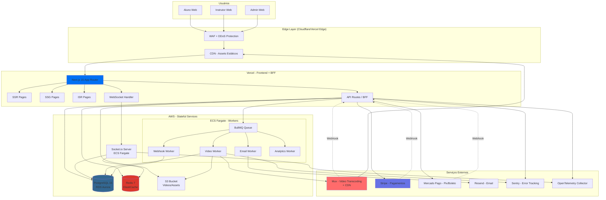
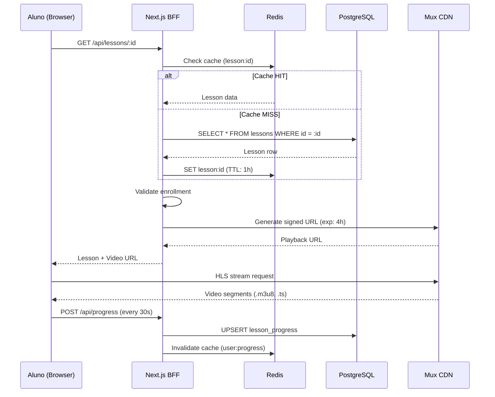
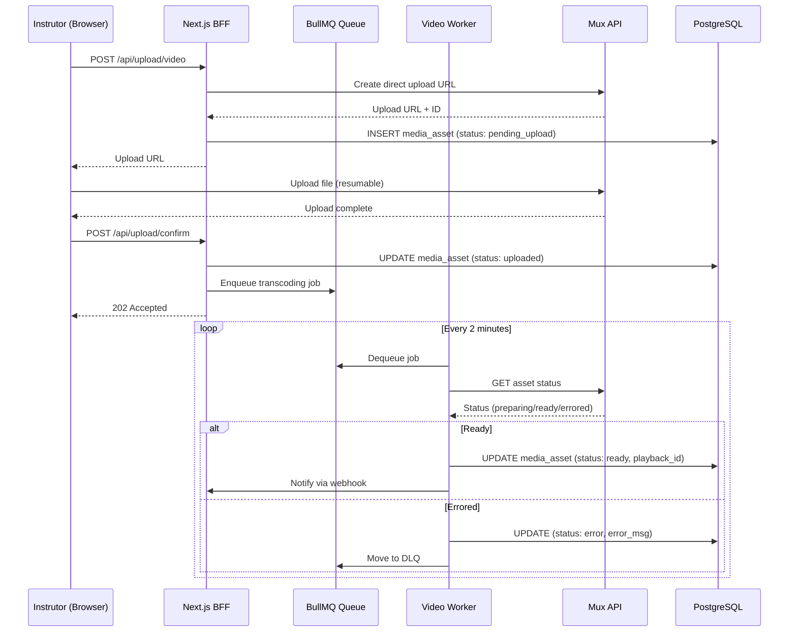
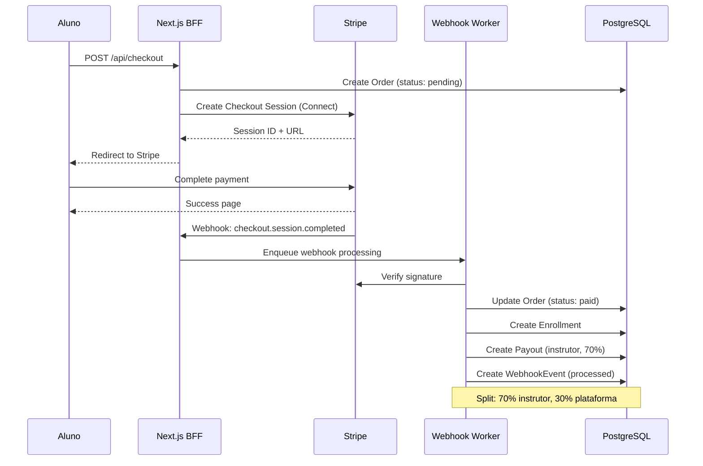

# 1. Arquitetura de Alto Nível

## Visão Geral

A plataforma EdTech será implementada como um **monólito modular** hospedado primariamente na Vercel, com serviços stateful complementares na AWS. Esta decisão prioriza simplicidade operacional, velocidade de desenvolvimento e custo previsível no MVP, mantendo um caminho claro para evolução futura.

## Diagrama de Arquitetura

## Componentes Principais

### 1. Frontend Layer (Vercel)

#### Next.js 15 - App Router
- **SSR (Server-Side Rendering):** Páginas dinâmicas que requerem dados em tempo real
  - Catálogo de cursos (com filtros)
  - Página de detalhes do curso
  - Dashboard do aluno/instrutor

- **SSG (Static Site Generation):** Conteúdo estático gerado em build
  - Homepage
  - Páginas institucionais (sobre, contato, termos)
  - Blog/artigos

- **ISR (Incremental Static Regeneration):** Conteúdo semi-estático com revalidação
  - Páginas de categoria
  - Landing pages de campanhas
  - Páginas de cursos populares

#### Edge Functions (Vercel Edge)
- Middleware de autenticação (JWT verification)
- Rate limiting básico
- Redirecionamentos e rewrites
- A/B testing headers

### 2. Backend Layer

#### API Routes / BFF (Backend for Frontend)
Hospedado na Vercel como API Routes do Next.js:
- **Auth API:** Login, registro, refresh tokens, 2FA
- **Courses API:** CRUD cursos, seções, aulas
- **Enrollment API:** Matrículas, progresso, certificados
- **Payments API:** Checkout, webhooks, reembolsos
- **Media API:** Presigned URLs para upload, metadata
- **Search API:** Full-text search com Postgres
- **User API:** Perfis, configurações, notificações

**Justificativa:** API Routes do Next.js oferecem:
- Co-localização com frontend (reduz latência)
- Deploy atômico (frontend + backend versionados juntos)
- Compartilhamento de código TypeScript
- Auto-scaling da Vercel

**Trade-off:** Limitação de 10s timeout (Hobby) / 60s (Pro) - workers externos para jobs longos.

#### Workers (AWS ECS Fargate)

**Video Worker**
- Processa upload de vídeos para Mux
- Monitora status de transcoding
- Atualiza metadata no banco
- Gera thumbnails adicionais (ImageMagick)

**Email Worker**
- Envia emails transacionais (Resend)
- Templates com React Email
- Retry logic com backoff exponencial

**Webhook Worker**
- Processa webhooks assíncronos (Stripe, Mercado Pago, Mux)
- Validação de assinaturas
- Deduplicação (tabela WebhookEvent)
- DLQ para falhas após 5 tentativas

**Analytics Worker**
- Agrega eventos de visualização
- Calcula métricas de engajamento
- Atualiza tabelas de analytics (materialized views)

**Justificativa para ECS Fargate:**
- Containers isolados com recursos dedicados
- Timeout ilimitado (transcoding pode levar 10+ minutos)
- Escalabilidade horizontal automática
- Custo: ~$15-30/mês por worker (0.25 vCPU, 512 MB)

**Alternativas consideradas:**
- **Vercel Serverless Functions:** Limitação de timeout (60s) e memória (1GB)
- **AWS Lambda:** Timeout de 15min ok, mas cold starts e complexidade de gestão de filas
- **Background Jobs no Next.js:** Não recomendado - bloqueia event loop

### 3. Socket.io Server (AWS ECS Fargate)

Servidor WebSocket dedicado para:
- Chat em tempo real (Q&A, suporte)
- Notificações push
- Atualizações de progresso de vídeo
- Presença online de instrutores

**Arquitetura:**
- Container Node.js rodando Socket.io
- Redis Adapter para clustering (múltiplas instâncias)
- Application Load Balancer com sticky sessions (IP-based)
- Autenticação via JWT no handshake

**Justificativa:**
- Vercel não suporta WebSockets persistentes (apenas Edge Functions com duração limitada)
- ECS permite manter conexões ativas indefinidamente
- Redis Adapter sincroniza mensagens entre instâncias

**Custo estimado:**
- 2 instâncias (HA): ~$30-40/mês
- ALB: ~$20/mês
- Total: ~$50-60/mês

### 4. Banco de Dados

#### PostgreSQL 15+ (AWS RDS Aurora Serverless v2)

**Configuração:**
- Instância: db.t4g.medium (2 vCPU, 4 GB RAM) inicial
- Storage: 50 GB SSD (auto-scaling até 500 GB)
- Backups: diários com retenção de 7 dias
- Read Replica: adicionar quando > 5k usuários ativos

**Schemas principais:**
- `public`: Tabelas de domínio (User, Course, Lesson, etc.)
- `analytics`: Materialized views para dashboards
- `audit`: Logs de auditoria (append-only)

**Extensões:**
- `pg_trgm`: Full-text search (trigram indexing)
- `uuid-ossp`: Geração de UUIDs
- `pgcrypto`: Criptografia de campos sensíveis

**Justificativa:**
- Aurora Serverless v2: auto-scaling de capacidade (2-16 ACUs)
- Custo previsível: ~$50-100/mês para MVP
- Compatibilidade Prisma: 100%
- Multi-AZ automático para HA

**Alternativas:**
- **Neon/Supabase:** Bom para MVP, mas menos controle e possíveis cold starts
- **RDS Provisioned:** Mais barato para cargas constantes, mas menos elástico

#### Redis 7 (AWS ElastiCache)

**Uso:**
- Cache de queries (curso detalhes, lista de aulas)
- Sessões de usuário (NextAuth.js adapter)
- Filas (BullMQ)
- Rate limiting (sliding window)
- Socket.io Adapter (pub/sub)

**Configuração:**
- Instância: cache.t4g.micro (2 vCPU, 0.5 GB) inicial
- Replicação: 1 réplica (read scaling)
- Persistence: Snapshotting diário

**Custo estimado:** ~$15-20/mês

### 5. Storage

#### AWS S3

**Buckets:**
- `edtech-videos-raw`: Uploads brutos (lifecycle: 7 dias → Glacier)
- `edtech-videos-processed`: HLS processados (Mux armazena, S3 como backup)
- `edtech-assets`: PDFs, anexos de aula, imagens de curso
- `edtech-certificates`: PDFs de certificados gerados

**Configurações:**
- Versionamento: desabilitado (otimização de custo)
- Encryption: SSE-S3 (server-side)
- CDN: CloudFront para assets públicos
- Lifecycle: raw → Glacier após 7 dias

**Custo estimado (100 GB storage + 500 GB transfer):** ~$10-15/mês

### 6. Serviços Externos

#### Mux - Video Platform

**Recursos utilizados:**
- **Direct Upload:** URLs presigned para upload direto do browser
- **Video Encoding:** Transcoding para HLS adaptativo (240p-1080p)
- **Video Streaming:** CDN global com signed URLs (anti-hotlink)
- **Webhooks:** Notificações de progresso de transcoding

**Custo estimado (100h vídeo + 10k views/mês):**
- Encoding: 100h × $0.005/min × 60 = $30
- Streaming: 10k views × 5min avg × $0.002/min = $100
- Total: ~$130/mês

**DRM:** Desabilitado no MVP (usar apenas signed URLs com expiração de 4h).

#### Stripe - Pagamentos

**Produtos:**
- **Stripe Checkout:** Fluxo de pagamento hospedado
- **Stripe Connect:** Split automático (plataforma ↔ instrutor)
- **Webhooks:** Confirmação de pagamentos, disputes, reembolsos

**Taxas:**
- Internacional: 4.99% + $0.30 por transação
- Brasil (cartão): 4.99% + R$ 0.40

#### Mercado Pago - Alternativa Brasil

**Uso:**
- Pix (transferência instantânea)
- Boleto bancário
- Cartão de crédito nacional

**Taxas:**
- Pix: 0.99%
- Boleto: R$ 3.49 fixo
- Cartão: 4.99% + R$ 0.40

**Integração:**
- SDK JavaScript para checkout
- Webhooks para confirmação de pagamento
- Idempotência via `X-Idempotency-Key`

#### Resend - Email Transacional

**Uso:**
- Confirmação de cadastro
- Reset de senha
- Notificações de compra/matrícula
- Certificados de conclusão

**Custo:** 3k emails/mês grátis, depois $0.001/email (~$10/mês para 10k emails).

#### Sentry - Error Tracking & Monitoring

**Uso:**
- Tracking de erros (frontend + backend)
- Performance monitoring (Web Vitals)
- Session replay (opcional)

**Custo:** Tier gratuito até 5k eventos/mês, depois $26/mês.

## Fluxos de Dados Principais

### Fluxo 1: Visualização de Aula

### Fluxo 2: Upload e Transcoding de Vídeo

### Fluxo 3: Compra com Split de Pagamento

## Decisão: Monólito Modular vs. Microsserviços

### Escolha: Monólito Modular (MVP/MMP)

**Justificativa:**

1. **Simplicidade Operacional:**
   - 1 repositório
   - 1 pipeline de CI/CD
   - 1 deploy (Vercel)
   - Menos serviços para monitorar

2. **Velocidade de Desenvolvimento:**
   - Compartilhamento de código (types, utils, validations)
   - Refactoring seguro (TypeScript cross-module)
   - Debugging mais simples (stack traces unificados)

3. **Custo Previsível:**
   - Vercel Pro: ~$20/mês
   - AWS (RDS + Redis + ECS): ~$150-200/mês
   - Total: ~$170-220/mês (vs. $500+ com microsserviços)

4. **Consistência de Dados:**
   - Transações ACID nativas
   - Sem necessidade de Saga Pattern ou compensações
   - Joins eficientes no banco

### Critérios para Evolução para Microsserviços

Considerar migração quando **2 ou mais** critérios forem atingidos:

| Critério | Threshold | Justificativa |
|----------|-----------|---------------|
| **Usuários ativos simultâneos** | > 50.000 | Necessidade de escala independente por módulo |
| **Tamanho do time** | > 15 devs | Múltiplos times precisam de autonomia de deploy |
| **Throughput de vídeos** | > 500 uploads/dia | Video pipeline precisa escalar independentemente |
| **Latência de API** | p95 > 500ms sustentado | Gargalos específicos exigem otimização isolada |
| **Custo de infra** | > R$ 5.000/mês | Otimização granular de recursos se torna ROI positivo |

### Estratégia de Migração Incremental

**Fase 1: Extração de Workers (já contemplado)**
- ✅ Video Worker
- ✅ Email Worker
- ✅ Webhook Worker
- ✅ Socket.io Server

**Fase 2: Serviços Candidatos (se critérios atingidos)**
1. **Payment Service:**
   - API isolada para checkout, webhooks, reconciliação
   - Banco de dados dedicado (PostgreSQL)
   - Comunicação via eventos (Kafka/RabbitMQ)

2. **Video Service:**
   - Gestão de uploads, transcoding, streaming
   - Isolamento total da pipeline de vídeo
   - Object Storage dedicado

3. **Search Service:**
   - Migração para Meilisearch/Algolia
   - Índice assíncrono via Change Data Capture (Debezium)
   - API dedicada de busca

**Fase 3: Domain-Driven Microservices**
- Course Service
- User Service
- Analytics Service
- Notification Service

**Tecnologias para evolução:**
- **API Gateway:** Kong, AWS API Gateway
- **Service Mesh:** Istio, Linkerd
- **Event Bus:** Kafka, RabbitMQ, AWS EventBridge
- **CDC:** Debezium (PostgreSQL → Kafka)

## Segurança da Arquitetura

### Camadas de Proteção

1. **Edge (WAF):**
   - Proteção DDoS (Cloudflare/Vercel)
   - Rate limiting por IP (100 req/min)
   - Bloqueio de bots maliciosos

2. **Application (Next.js):**
   - Middleware de autenticação (JWT)
   - CSRF tokens (Next.js CSRF protection)
   - Rate limiting por usuário (Redis)
   - Validação de input (Zod schemas)

3. **Data (RDS/Redis):**
   - VPC privada (sem IPs públicos)
   - Security Groups restritivos
   - Encryption at rest (AES-256)
   - Encryption in transit (TLS 1.3)

4. **Secrets Management:**
   - AWS Secrets Manager para credenciais
   - Rotação automática de secrets (90 dias)
   - Variáveis de ambiente via Vercel Env Vars

### Compliance LGPD

| Requisito | Implementação |
|-----------|---------------|
| **Base legal** | Consentimento explícito no cadastro (checkbox) |
| **Minimização de dados** | Coletar apenas email, nome, CPF (pagamentos) |
| **Direito de acesso** | API `/api/user/data-export` (JSON) |
| **Direito de exclusão** | Soft delete + anonimização após 90 dias |
| **Portabilidade** | Export em JSON estruturado |
| **Criptografia** | TLS 1.3 (trânsito), AES-256 (repouso) |
| **Retenção** | 5 anos para dados fiscais, 2 anos para logs |
| **Consentimento de cookies** | Banner de consentimento (essential, analytics, marketing) |

## Custo Total Estimado (MVP - 5-10k usuários)

| Serviço | Custo Mensal (R$) | Observações |
|---------|-------------------|-------------|
| **Vercel Pro** | R$ 100 | Deploy frontend + API Routes |
| **AWS RDS Aurora** | R$ 250-500 | db.t4g.medium + backups |
| **AWS ElastiCache** | R$ 75-100 | cache.t4g.micro |
| **AWS S3 + CloudFront** | R$ 50-100 | 100 GB storage + 500 GB transfer |
| **AWS ECS Fargate** | R$ 150-200 | 4 workers + Socket.io server |
| **Mux** | R$ 650-800 | 100h encoding + 10k views |
| **Stripe** | Variável | 4.99% por transação |
| **Mercado Pago** | Variável | 0.99-4.99% por transação |
| **Resend** | R$ 50 | 10k emails/mês |
| **Sentry** | R$ 0-130 | Tier gratuito inicialmente |
| **TOTAL** | **R$ 1.325-1.980** | ~$265-396 USD |

**Nota:** Custos de pagamento são variáveis e dependem do GMV (Gross Merchandise Value).

## SLAs e Disponibilidade

### Targets

| Métrica | Target MVP | Target Escala |
|---------|------------|---------------|
| **Uptime** | 99.9% (43m downtime/mês) | 99.95% (21m/mês) |
| **Latência API (p95)** | < 300ms | < 200ms |
| **Latência SSR (p95)** | < 800ms | < 500ms |
| **TTFB** | < 200ms | < 150ms |
| **Video Start Time** | < 3s | < 2s |
| **Transcoding SLA** | < 15min (95% dos casos) | < 10min |

### Dependências Críticas

| Serviço | SLA Provedor | Impacto se down | Mitigação |
|---------|--------------|-----------------|-----------|
| **Vercel** | 99.99% | Site offline | Fallback: Deploy estático no S3 |
| **RDS Aurora** | 99.95% (Multi-AZ) | Leitura/escrita offline | Read Replica + Circuit Breaker |
| **Redis** | 99.9% | Cache miss, sessões offline | Fallback: Direct DB queries |
| **Mux** | 99.9% | Upload/playback offline | Fallback: Uploads pausados, cache de URLs |
| **Stripe** | 99.99% | Pagamentos offline | Queue de retry (24h) |

## Observabilidade

### Métricas-Chave (Golden Signals)

1. **Latência:**
   - API endpoints (p50, p95, p99)
   - SSR pages (TTFB)
   - Database queries (slow query log)

2. **Tráfego:**
   - Requests/segundo por endpoint
   - WebSocket connections ativas
   - Queue throughput (jobs/segundo)

3. **Erros:**
   - Taxa de erro por endpoint (5xx, 4xx)
   - Erros de transcoding
   - Webhook failures

4. **Saturação:**
   - CPU/RAM (ECS tasks, RDS)
   - Conexões de DB (% uso)
   - Queue depth (mensagens pendentes)

### Ferramentas

| Camada | Ferramenta | Propósito |
|--------|------------|-----------|
| **APM** | Vercel Analytics + Sentry | Performance frontend |
| **Backend Tracing** | OpenTelemetry → Jaeger | Distributed tracing |
| **Logs** | Vercel Logs + CloudWatch | Logs centralizados |
| **Metrics** | Prometheus + Grafana | Dashboards customizados |
| **Alerting** | PagerDuty / Opsgenie | Incidentes críticos |

## Pendências & Decisões em Aberto

### Decisões Pendentes

1. **[DECISÃO PENDENTE] Provider de Email:**
   - **Opções:** Resend vs. AWS SES vs. SendGrid
   - **Recomendação:** Resend (DX superior, $10/mês suficiente para MVP)

2. **[DECISÃO PENDENTE] Search em Escala:**
   - **Trigger:** Quando catálogo > 5.000 cursos OU queries > 100/s
   - **Opção 1:** Meilisearch (self-hosted ECS, ~$30/mês)
   - **Opção 2:** Algolia (SaaS, ~$1/1000 searches)
   - **Recomendação:** Postgres FTS no MVP, Meilisearch quando atingir trigger

3. **[DECISÃO PENDENTE] CDN para Assets:**
   - **Opção 1:** CloudFront (integração S3, ~$0.085/GB)
   - **Opção 2:** Cloudflare R2 + CDN ($0/egress até 10TB!)
   - **Recomendação:** Cloudflare R2 (custo zero de egress é game-changer)

### Hipóteses a Validar

1. **[HIPÓTESE] Transcoding Time:**
   - Assumindo Mux processa 1min de vídeo em ~30s (média)
   - Vídeo de 2h → ~1h de transcoding
   - **Validar:** Executar testes com vídeos reais antes do lançamento

2. **[HIPÓTESE] WebSocket Scaling:**
   - Assumindo 1 instância Socket.io suporta 5.000 conexões simultâneas
   - **Validar:** Load testing com k6/Artillery antes do lançamento

3. **[HIPÓTESE] Database IOPS:**
   - Assumindo 5-10k usuários geram ~500 queries/s
   - db.t4g.medium (Baseline IOPS: 3000) é suficiente
   - **Validar:** Monitorar métricas de IOPS na primeira semana pós-lançamento

### Riscos Arquiteturais

| Risco | Probabilidade | Impacto | Mitigação |
|-------|---------------|---------|-----------|
| **Timeout de API Routes Vercel** | Média | Alto | Mover jobs longos para workers ECS |
| **Cold start de Functions** | Baixa | Médio | Provisioned Concurrency (custo extra) |
| **Custos de Mux acima do esperado** | Alta | Alto | Implementar limites de upload (max 2h/vídeo) |
| **Lock-in de Vercel** | Média | Médio | Manter Next.js standalone-ready (Docker build) |

---

**Próximos Passos:**
1. Revisar e aprovar esta arquitetura com stakeholders
2. Criar ADRs detalhados (próximo documento)
3. Implementar PoC de componentes críticos (Socket.io, Mux integration)
4. Provisionar infraestrutura AWS (Terraform/CDK)
