# 3. Modelagem de Dados

## Visão Geral

A modelagem de dados da plataforma EdTech segue princípios de **normalização 3NF**, com desnormalização seletiva para otimização de queries. O schema é projetado para PostgreSQL 15+ com Prisma ORM.

## Diagrama Entidade-Relacionamento (ERD)

```mermaid
erDiagram
    User ||--o{ Course : "creates (instructor)"
    User ||--o{ Enrollment : "enrolls in"
    User ||--o{ Order : "places"
    User ||--o{ Review : "writes"
    User ||--o{ Question : "asks"
    User ||--o{ Answer : "answers"
    User ||--o{ CompletedLesson : "completes"
    User ||--o{ Certificate : "receives"
    User ||--o{ Notification : "receives"
    User ||--o{ Ticket : "creates"
    User ||--|| InstructorProfile : "has (optional)"
    User ||--|| StudentProfile : "has (optional)"
    User ||--|| Cart : "has"
    User ||--o{ Wishlist : "has items"
    User ||--o{ Note : "writes"
    User ||--o{ ChatParticipant : "participates"
    User ||--o{ ChatMessage : "sends"
    User ||--o{ Payout : "receives"
    User ||--o{ Coupon : "creates"

    Course ||--o{ Section : "contains"
    Course ||--o{ Enrollment : "has students"
    Course ||--o{ Review : "receives"
    Course ||--o{ OrderItem : "is purchased"
    Course ||--o{ Question : "has discussions"
    Course ||--o{ Certificate : "grants"
    Course ||--o{ Announcement : "has"
    Course ||--o{ Coupon : "has"
    Course ||--o{ Wishlist : "in wishlist"
    Course ||--o{ CartItem : "in cart"
    Course }o--|| Category : "belongs to"
    Course }o--o{ Tag : "has tags"

    Section ||--o{ Lesson : "contains"

    Lesson ||--|| LessonAsset : "has (optional)"
    Lesson ||--o{ Attachment : "has"
    Lesson ||--o{ CompletedLesson : "completed by"
    Lesson ||--o{ Question : "has questions"
    Lesson ||--o{ Note : "has notes"

    LessonAsset ||--o{ TranscodingJob : "has jobs"

    Order ||--o{ OrderItem : "contains"
    Order ||--|| Payment : "has payment"

    Payment ||--o{ Refund : "has refunds"
    Payment ||--o{ Payout : "splits to"

    Cart ||--o{ CartItem : "contains"

    Chat ||--o{ ChatParticipant : "has participants"
    Chat ||--o{ ChatMessage : "has messages"

    Question ||--o{ Answer : "has answers"

    WebhookEvent ||--|| Payment : "related to"
    WebhookEvent ||--|| TranscodingJob : "related to"
```



## Entidades Principais (32 tabelas)

### Módulo 1: Autenticação e Usuários

#### 1.1 User
**Descrição:** Usuário da plataforma (aluno, instrutor ou admin).

| Campo | Tipo | Restrições | Descrição |
|-------|------|------------|-----------|
| id | UUID | PK | Identificador único |
| email | VARCHAR(255) | UNIQUE, NOT NULL | Email (login) |
| emailVerified | TIMESTAMP | NULL | Data de verificação |
| passwordHash | VARCHAR(255) | NULL | Hash bcrypt (null se OAuth) |
| name | VARCHAR(255) | NOT NULL | Nome completo |
| image | TEXT | NULL | Avatar URL |
| role | ENUM | NOT NULL, DEFAULT: STUDENT | STUDENT, INSTRUCTOR, ADMIN |
| isActive | BOOLEAN | NOT NULL, DEFAULT: true | Conta ativa/suspensa |
| createdAt | TIMESTAMP | NOT NULL, DEFAULT: now() | Data de criação |
| updatedAt | TIMESTAMP | NOT NULL | Data de atualização |
| deletedAt | TIMESTAMP | NULL | Soft delete |

**Índices:**
- `idx_user_email` (email)
- `idx_user_role` (role)
- `idx_user_created_at` (createdAt DESC)

**Relacionamentos:**
- 1:N com Course (como instrutor)
- 1:N com Enrollment
- 1:N com Order
- 1:1 com InstructorProfile
- 1:1 com StudentProfile
- 1:1 com Cart

#### 1.2 Account (NextAuth.js)
**Descrição:** Contas OAuth (Google, GitHub, etc.).

| Campo | Tipo | Restrições | Descrição |
|-------|------|------------|-----------|
| id | UUID | PK | Identificador único |
| userId | UUID | FK → User.id, NOT NULL | Usuário vinculado |
| type | VARCHAR(50) | NOT NULL | oauth, email, credentials |
| provider | VARCHAR(50) | NOT NULL | google, github, credentials |
| providerAccountId | VARCHAR(255) | NOT NULL | ID na plataforma OAuth |
| refresh_token | TEXT | NULL | Token de refresh |
| access_token | TEXT | NULL | Token de acesso |
| expires_at | INTEGER | NULL | Unix timestamp |
| token_type | VARCHAR(50) | NULL | Bearer, etc. |
| scope | VARCHAR(255) | NULL | Escopos OAuth |
| id_token | TEXT | NULL | JWT ID token |
| session_state | VARCHAR(255) | NULL | Estado da sessão |

**Constraint:** UNIQUE(provider, providerAccountId)

#### 1.3 Session (NextAuth.js)
**Descrição:** Sessões ativas (se não usar JWT puro).

| Campo | Tipo | Restrições | Descrição |
|-------|------|------------|-----------|
| id | UUID | PK | Identificador único |
| sessionToken | VARCHAR(255) | UNIQUE, NOT NULL | Token da sessão |
| userId | UUID | FK → User.id, NOT NULL | Usuário da sessão |
| expires | TIMESTAMP | NOT NULL | Expiração |

#### 1.4 VerificationToken (NextAuth.js)
**Descrição:** Tokens de verificação (email, reset senha).

| Campo | Tipo | Restrições | Descrição |
|-------|------|------------|-----------|
| identifier | VARCHAR(255) | NOT NULL | Email ou user ID |
| token | VARCHAR(255) | UNIQUE, NOT NULL | Token único |
| expires | TIMESTAMP | NOT NULL | Expiração |

**Constraint:** UNIQUE(identifier, token)

#### 1.5 InstructorProfile
**Descrição:** Perfil adicional para instrutores.

| Campo | Tipo | Restrições | Descrição |
|-------|------|------------|-----------|
| id | UUID | PK | Identificador único |
| userId | UUID | FK → User.id, UNIQUE, NOT NULL | Usuário vinculado |
| bio | TEXT | NULL | Biografia pública |
| headline | VARCHAR(255) | NULL | Título curto |
| websiteUrl | VARCHAR(500) | NULL | Site pessoal |
| linkedinUrl | VARCHAR(500) | NULL | LinkedIn |
| youtubeUrl | VARCHAR(500) | NULL | YouTube |
| stripeAccountId | VARCHAR(255) | UNIQUE, NULL | Stripe Connect ID |
| paypalEmail | VARCHAR(255) | NULL | Email PayPal |
| balance | DECIMAL(12,2) | NOT NULL, DEFAULT: 0 | Saldo disponível (BRL) |
| totalEarnings | DECIMAL(12,2) | NOT NULL, DEFAULT: 0 | Total ganho histórico |
| onboardingCompleted | BOOLEAN | NOT NULL, DEFAULT: false | Onboarding Stripe concluído |
| createdAt | TIMESTAMP | NOT NULL, DEFAULT: now() | Data de criação |

#### 1.6 StudentProfile
**Descrição:** Perfil adicional para alunos.

| Campo | Tipo | Restrições | Descrição |
|-------|------|------------|-----------|
| id | UUID | PK | Identificador único |
| userId | UUID | FK → User.id, UNIQUE, NOT NULL | Usuário vinculado |
| headline | VARCHAR(255) | NULL | Título/profissão |
| bio | TEXT | NULL | Sobre mim |
| interests | TEXT[] | NULL | Interesses (array) |
| createdAt | TIMESTAMP | NOT NULL, DEFAULT: now() | Data de criação |

### Módulo 2: Cursos

#### 2.1 Course
**Descrição:** Curso criado por um instrutor.

| Campo | Tipo | Restrições | Descrição |
|-------|------|------------|-----------|
| id | UUID | PK | Identificador único |
| title | VARCHAR(255) | NOT NULL | Título do curso |
| slug | VARCHAR(255) | UNIQUE, NOT NULL | URL-friendly slug |
| subtitle | VARCHAR(500) | NULL | Subtítulo |
| description | TEXT | NOT NULL | Descrição completa |
| imageUrl | TEXT | NULL | Thumbnail (S3 URL) |
| promoVideoUrl | TEXT | NULL | Vídeo promocional |
| price | DECIMAL(10,2) | NOT NULL | Preço em BRL |
| originalPrice | DECIMAL(10,2) | NULL | Preço original (antes desconto) |
| level | ENUM | NOT NULL | BEGINNER, INTERMEDIATE, ADVANCED, ALL_LEVELS |
| language | VARCHAR(10) | NOT NULL, DEFAULT: 'pt-BR' | Idioma do conteúdo |
| categoryId | UUID | FK → Category.id, NOT NULL | Categoria principal |
| instructorId | UUID | FK → User.id, NOT NULL | Instrutor criador |
| isPublished | BOOLEAN | NOT NULL, DEFAULT: false | Publicado/rascunho |
| publishedAt | TIMESTAMP | NULL | Data de publicação |
| enrollmentCount | INTEGER | NOT NULL, DEFAULT: 0 | Total de matrículas (denormalized) |
| averageRating | DECIMAL(3,2) | NULL | Média de avaliações (denormalized) |
| reviewCount | INTEGER | NOT NULL, DEFAULT: 0 | Total de reviews (denormalized) |
| totalDuration | INTEGER | NULL | Duração total em segundos (denormalized) |
| totalLessons | INTEGER | NOT NULL, DEFAULT: 0 | Total de aulas (denormalized) |
| createdAt | TIMESTAMP | NOT NULL, DEFAULT: now() | Data de criação |
| updatedAt | TIMESTAMP | NOT NULL | Data de atualização |
| deletedAt | TIMESTAMP | NULL | Soft delete |

**Índices:**
- `idx_course_slug` (slug)
- `idx_course_instructor` (instructorId)
- `idx_course_category` (categoryId)
- `idx_course_published` (isPublished, publishedAt DESC)
- `idx_course_rating` (averageRating DESC, enrollmentCount DESC)
- `idx_course_search` (title, description) usando pg_trgm

#### 2.2 Category
**Descrição:** Categoria de curso (ex: Desenvolvimento, Design, Marketing).

| Campo | Tipo | Restrições | Descrição |
|-------|------|------------|-----------|
| id | UUID | PK | Identificador único |
| name | VARCHAR(100) | UNIQUE, NOT NULL | Nome da categoria |
| slug | VARCHAR(100) | UNIQUE, NOT NULL | URL-friendly slug |
| description | TEXT | NULL | Descrição |
| icon | VARCHAR(50) | NULL | Nome do ícone (ex: 'code', 'design') |
| parentId | UUID | FK → Category.id, NULL | Categoria pai (hierarquia) |
| order | INTEGER | NOT NULL, DEFAULT: 0 | Ordem de exibição |
| isActive | BOOLEAN | NOT NULL, DEFAULT: true | Ativa/inativa |
| createdAt | TIMESTAMP | NOT NULL, DEFAULT: now() | Data de criação |

#### 2.3 Tag
**Descrição:** Tags para cursos (ex: JavaScript, React, Node.js).

| Campo | Tipo | Restrições | Descrição |
|-------|------|------------|-----------|
| id | UUID | PK | Identificador único |
| name | VARCHAR(50) | UNIQUE, NOT NULL | Nome da tag |
| slug | VARCHAR(50) | UNIQUE, NOT NULL | URL-friendly slug |
| courseCount | INTEGER | NOT NULL, DEFAULT: 0 | Total de cursos (denormalized) |

#### 2.4 CourseTag (M:N)
**Descrição:** Relação curso-tag.

| Campo | Tipo | Restrições | Descrição |
|-------|------|------------|-----------|
| courseId | UUID | FK → Course.id, NOT NULL | Curso |
| tagId | UUID | FK → Tag.id, NOT NULL | Tag |

**PK:** (courseId, tagId)
**Índices:**
- `idx_course_tag_course` (courseId)
- `idx_course_tag_tag` (tagId)

#### 2.5 CourseRequirement
**Descrição:** Pré-requisitos do curso.

| Campo | Tipo | Restrições | Descrição |
|-------|------|------------|-----------|
| id | UUID | PK | Identificador único |
| courseId | UUID | FK → Course.id, NOT NULL | Curso |
| requirement | TEXT | NOT NULL | Descrição do requisito |
| order | INTEGER | NOT NULL, DEFAULT: 0 | Ordem de exibição |

#### 2.6 LearningObjective
**Descrição:** O que o aluno vai aprender.

| Campo | Tipo | Restrições | Descrição |
|-------|------|------------|-----------|
| id | UUID | PK | Identificador único |
| courseId | UUID | FK → Course.id, NOT NULL | Curso |
| objective | TEXT | NOT NULL | Descrição do objetivo |
| order | INTEGER | NOT NULL, DEFAULT: 0 | Ordem de exibição |

#### 2.7 TargetAudience
**Descrição:** Para quem é o curso.

| Campo | Tipo | Restrições | Descrição |
|-------|------|------------|-----------|
| id | UUID | PK | Identificador único |
| courseId | UUID | FK → Course.id, NOT NULL | Curso |
| description | TEXT | NOT NULL | Descrição do público-alvo |
| order | INTEGER | NOT NULL, DEFAULT: 0 | Ordem de exibição |

### Módulo 3: Estrutura do Curso

#### 3.1 Section
**Descrição:** Seção (módulo) dentro de um curso.

| Campo | Tipo | Restrições | Descrição |
|-------|------|------------|-----------|
| id | UUID | PK | Identificador único |
| courseId | UUID | FK → Course.id, NOT NULL | Curso pai |
| title | VARCHAR(255) | NOT NULL | Título da seção |
| description | TEXT | NULL | Descrição |
| order | INTEGER | NOT NULL | Ordem na listagem |
| createdAt | TIMESTAMP | NOT NULL, DEFAULT: now() | Data de criação |
| updatedAt | TIMESTAMP | NOT NULL | Data de atualização |

**Índices:**
- `idx_section_course_order` (courseId, order)

#### 3.2 Lesson
**Descrição:** Aula dentro de uma seção.

| Campo | Tipo | Restrições | Descrição |
|-------|------|------------|-----------|
| id | UUID | PK | Identificador único |
| sectionId | UUID | FK → Section.id, NOT NULL | Seção pai |
| title | VARCHAR(255) | NOT NULL | Título da aula |
| description | TEXT | NULL | Descrição |
| order | INTEGER | NOT NULL | Ordem na seção |
| duration | INTEGER | NULL | Duração em segundos |
| type | ENUM | NOT NULL | VIDEO, ARTICLE, QUIZ, ASSIGNMENT |
| isFreePreview | BOOLEAN | NOT NULL, DEFAULT: false | Preview gratuito |
| createdAt | TIMESTAMP | NOT NULL, DEFAULT: now() | Data de criação |
| updatedAt | TIMESTAMP | NOT NULL | Data de atualização |

**Índices:**
- `idx_lesson_section_order` (sectionId, order)

#### 3.3 LessonAsset
**Descrição:** Asset de mídia (vídeo, artigo) da aula.

| Campo | Tipo | Restrições | Descrição |
|-------|------|------------|-----------|
| id | UUID | PK | Identificador único |
| lessonId | UUID | FK → Lesson.id, UNIQUE, NOT NULL | Aula vinculada |
| type | ENUM | NOT NULL | VIDEO, ARTICLE |
| content | TEXT | NULL | Conteúdo (se ARTICLE, markdown) |
| storageKey | VARCHAR(500) | NULL | Chave S3 (se VIDEO, upload original) |
| muxAssetId | VARCHAR(255) | NULL | Mux Asset ID |
| muxPlaybackId | VARCHAR(255) | NULL | Mux Playback ID |
| duration | DECIMAL(10,2) | NULL | Duração em segundos |
| status | ENUM | NOT NULL, DEFAULT: PENDING | PENDING, UPLOADING, PROCESSING, READY, ERROR |
| errorMessage | TEXT | NULL | Mensagem de erro |
| uploadCompletedAt | TIMESTAMP | NULL | Data de conclusão do upload |
| processingCompletedAt | TIMESTAMP | NULL | Data de conclusão do processamento |
| createdAt | TIMESTAMP | NOT NULL, DEFAULT: now() | Data de criação |
| updatedAt | TIMESTAMP | NOT NULL | Data de atualização |

**Índices:**
- `idx_lesson_asset_mux` (muxAssetId)
- `idx_lesson_asset_status` (status)

#### 3.4 Attachment
**Descrição:** Arquivos anexos (PDFs, ZIPs, etc.).

| Campo | Tipo | Restrições | Descrição |
|-------|------|------------|-----------|
| id | UUID | PK | Identificador único |
| lessonId | UUID | FK → Lesson.id, NOT NULL | Aula vinculada |
| name | VARCHAR(255) | NOT NULL | Nome do arquivo |
| storageKey | VARCHAR(500) | NOT NULL | Chave S3 |
| url | TEXT | NOT NULL | URL assinada (gerada dinamicamente) |
| size | BIGINT | NOT NULL | Tamanho em bytes |
| mimeType | VARCHAR(100) | NOT NULL | Tipo MIME |
| createdAt | TIMESTAMP | NOT NULL, DEFAULT: now() | Data de upload |

### Módulo 4: Matrículas e Progresso

#### 4.1 Enrollment
**Descrição:** Matrícula de um aluno em um curso.

| Campo | Tipo | Restrições | Descrição |
|-------|------|------------|-----------|
| id | UUID | PK | Identificador único |
| userId | UUID | FK → User.id, NOT NULL | Aluno |
| courseId | UUID | FK → Course.id, NOT NULL | Curso |
| orderId | UUID | FK → Order.id, NULL | Pedido que gerou a matrícula |
| progress | DECIMAL(5,2) | NOT NULL, DEFAULT: 0 | Progresso (0-100) |
| completedLessons | INTEGER | NOT NULL, DEFAULT: 0 | Total de aulas completadas |
| lastAccessedAt | TIMESTAMP | NULL | Último acesso ao curso |
| completedAt | TIMESTAMP | NULL | Data de conclusão (100%) |
| createdAt | TIMESTAMP | NOT NULL, DEFAULT: now() | Data de matrícula |
| updatedAt | TIMESTAMP | NOT NULL | Data de atualização |

**Constraint:** UNIQUE(userId, courseId)
**Índices:**
- `idx_enrollment_user` (userId)
- `idx_enrollment_course` (courseId)
- `idx_enrollment_progress` (userId, progress)

#### 4.2 LessonProgress
**Descrição:** Progresso do aluno em uma aula específica.

| Campo | Tipo | Restrições | Descrição |
|-------|------|------------|-----------|
| id | UUID | PK | Identificador único |
| enrollmentId | UUID | FK → Enrollment.id, NOT NULL | Matrícula |
| lessonId | UUID | FK → Lesson.id, NOT NULL | Aula |
| watchedDuration | INTEGER | NOT NULL, DEFAULT: 0 | Duração assistida (segundos) |
| isCompleted | BOOLEAN | NOT NULL, DEFAULT: false | Aula completada |
| completedAt | TIMESTAMP | NULL | Data de conclusão |
| lastWatchedAt | TIMESTAMP | NULL | Último acesso |
| createdAt | TIMESTAMP | NOT NULL, DEFAULT: now() | Data de criação |
| updatedAt | TIMESTAMP | NOT NULL | Data de atualização |

**Constraint:** UNIQUE(enrollmentId, lessonId)
**Índices:**
- `idx_lesson_progress_enrollment` (enrollmentId)
- `idx_lesson_progress_lesson` (lessonId)

#### 4.3 Certificate
**Descrição:** Certificado emitido ao concluir curso.

| Campo | Tipo | Restrições | Descrição |
|-------|------|------------|-----------|
| id | UUID | PK | Identificador único |
| userId | UUID | FK → User.id, NOT NULL | Aluno |
| courseId | UUID | FK → Course.id, NOT NULL | Curso |
| enrollmentId | UUID | FK → Enrollment.id, NOT NULL | Matrícula vinculada |
| certificateNumber | VARCHAR(50) | UNIQUE, NOT NULL | Número do certificado (ex: CERT-2024-001234) |
| pdfUrl | TEXT | NULL | URL do PDF (S3) |
| issuedAt | TIMESTAMP | NOT NULL, DEFAULT: now() | Data de emissão |
| verifiedAt | TIMESTAMP | NULL | Data de verificação (se aplicável) |

**Constraint:** UNIQUE(userId, courseId)

### Módulo 5: Pagamentos e Financeiro

#### 5.1 Order
**Descrição:** Pedido de compra.

| Campo | Tipo | Restrições | Descrição |
|-------|------|------------|-----------|
| id | UUID | PK | Identificador único |
| userId | UUID | FK → User.id, NOT NULL | Comprador |
| subtotal | DECIMAL(10,2) | NOT NULL | Subtotal (sem descontos) |
| discountAmount | DECIMAL(10,2) | NOT NULL, DEFAULT: 0 | Valor do desconto |
| total | DECIMAL(10,2) | NOT NULL | Total final |
| currency | VARCHAR(3) | NOT NULL, DEFAULT: 'BRL' | Moeda (ISO 4217) |
| status | ENUM | NOT NULL, DEFAULT: PENDING | PENDING, PAID, FAILED, REFUNDED, CANCELLED |
| couponCode | VARCHAR(50) | NULL | Cupom aplicado |
| ipAddress | INET | NULL | IP do comprador |
| userAgent | TEXT | NULL | User agent |
| metadata | JSONB | NULL | Metadados extras |
| createdAt | TIMESTAMP | NOT NULL, DEFAULT: now() | Data de criação |
| updatedAt | TIMESTAMP | NOT NULL | Data de atualização |

**Índices:**
- `idx_order_user` (userId)
- `idx_order_status` (status)
- `idx_order_created` (createdAt DESC)

#### 5.2 OrderItem
**Descrição:** Item de um pedido.

| Campo | Tipo | Restrições | Descrição |
|-------|------|------------|-----------|
| id | UUID | PK | Identificador único |
| orderId | UUID | FK → Order.id, NOT NULL | Pedido |
| courseId | UUID | FK → Course.id, NOT NULL | Curso comprado |
| priceAtPurchase | DECIMAL(10,2) | NOT NULL | Preço no momento da compra |
| currency | VARCHAR(3) | NOT NULL | Moeda |

**Índices:**
- `idx_order_item_order` (orderId)
- `idx_order_item_course` (courseId)

#### 5.3 Payment
**Descrição:** Pagamento de um pedido.

| Campo | Tipo | Restrições | Descrição |
|-------|------|------------|-----------|
| id | UUID | PK | Identificador único |
| orderId | UUID | FK → Order.id, UNIQUE, NOT NULL | Pedido vinculado |
| provider | ENUM | NOT NULL | STRIPE, MERCADOPAGO, PAYPAL |
| providerPaymentId | VARCHAR(255) | UNIQUE, NOT NULL | ID no gateway |
| method | VARCHAR(50) | NULL | credit_card, pix, boleto, paypal |
| amount | DECIMAL(10,2) | NOT NULL | Valor pago |
| currency | VARCHAR(3) | NOT NULL | Moeda |
| status | ENUM | NOT NULL | PENDING, PROCESSING, SUCCEEDED, FAILED, REFUNDED |
| paidAt | TIMESTAMP | NULL | Data de confirmação |
| failureReason | TEXT | NULL | Motivo de falha |
| receiptUrl | TEXT | NULL | URL do recibo |
| metadata | JSONB | NULL | Metadados do gateway |
| createdAt | TIMESTAMP | NOT NULL, DEFAULT: now() | Data de criação |
| updatedAt | TIMESTAMP | NOT NULL | Data de atualização |

**Índices:**
- `idx_payment_order` (orderId)
- `idx_payment_provider_id` (provider, providerPaymentId)
- `idx_payment_status` (status)

#### 5.4 Refund
**Descrição:** Reembolso de um pagamento.

| Campo | Tipo | Restrições | Descrição |
|-------|------|------------|-----------|
| id | UUID | PK | Identificador único |
| paymentId | UUID | FK → Payment.id, NOT NULL | Pagamento original |
| amount | DECIMAL(10,2) | NOT NULL | Valor reembolsado |
| currency | VARCHAR(3) | NOT NULL | Moeda |
| reason | TEXT | NULL | Motivo do reembolso |
| status | ENUM | NOT NULL | PENDING, SUCCEEDED, FAILED, CANCELLED |
| providerRefundId | VARCHAR(255) | UNIQUE, NULL | ID no gateway |
| processedAt | TIMESTAMP | NULL | Data de processamento |
| createdAt | TIMESTAMP | NOT NULL, DEFAULT: now() | Data de solicitação |
| updatedAt | TIMESTAMP | NOT NULL | Data de atualização |

#### 5.5 CommissionRule
**Descrição:** Regras de comissão para instrutores.

| Campo | Tipo | Restrições | Descrição |
|-------|------|------------|-----------|
| id | UUID | PK | Identificador único |
| instructorId | UUID | FK → User.id, NULL | Instrutor específico (NULL = global) |
| percentage | DECIMAL(5,2) | NOT NULL | Percentual (0-100) |
| isActive | BOOLEAN | NOT NULL, DEFAULT: true | Ativa/inativa |
| effectiveFrom | TIMESTAMP | NOT NULL | Válida a partir de |
| effectiveUntil | TIMESTAMP | NULL | Válida até (NULL = indefinido) |
| createdAt | TIMESTAMP | NOT NULL, DEFAULT: now() | Data de criação |

**Default:** 70% instrutor, 30% plataforma

#### 5.6 Payout
**Descrição:** Pagamento (saque) para instrutor.

| Campo | Tipo | Restrições | Descrição |
|-------|------|------------|-----------|
| id | UUID | PK | Identificador único |
| instructorId | UUID | FK → User.id, NOT NULL | Instrutor recebedor |
| amount | DECIMAL(10,2) | NOT NULL | Valor a pagar |
| currency | VARCHAR(3) | NOT NULL, DEFAULT: 'BRL' | Moeda |
| method | ENUM | NOT NULL | STRIPE_TRANSFER, PAYPAL, BANK_TRANSFER |
| status | ENUM | NOT NULL, DEFAULT: PENDING | PENDING, PROCESSING, SUCCEEDED, FAILED, CANCELLED |
| providerPayoutId | VARCHAR(255) | UNIQUE, NULL | ID no gateway |
| scheduledFor | TIMESTAMP | NULL | Data agendada |
| processedAt | TIMESTAMP | NULL | Data de processamento |
| failureReason | TEXT | NULL | Motivo de falha |
| metadata | JSONB | NULL | Metadados extras |
| createdAt | TIMESTAMP | NOT NULL, DEFAULT: now() | Data de solicitação |
| updatedAt | TIMESTAMP | NOT NULL | Data de atualização |

**Índices:**
- `idx_payout_instructor` (instructorId)
- `idx_payout_status` (status)
- `idx_payout_scheduled` (scheduledFor)

#### 5.7 Coupon
**Descrição:** Cupom de desconto.

| Campo | Tipo | Restrições | Descrição |
|-------|------|------------|-----------|
| id | UUID | PK | Identificador único |
| code | VARCHAR(50) | UNIQUE, NOT NULL | Código (ex: BLACKFRIDAY2024) |
| type | ENUM | NOT NULL | PERCENTAGE, FIXED_AMOUNT |
| value | DECIMAL(10,2) | NOT NULL | Valor (% ou R$) |
| currency | VARCHAR(3) | NULL | Moeda (se FIXED_AMOUNT) |
| courseId | UUID | FK → Course.id, NULL | Curso específico (NULL = global) |
| instructorId | UUID | FK → User.id, NULL | Instrutor criador (NULL = admin) |
| maxUses | INTEGER | NULL | Máximo de usos (NULL = ilimitado) |
| usedCount | INTEGER | NOT NULL, DEFAULT: 0 | Total de usos |
| minPurchaseAmount | DECIMAL(10,2) | NULL | Valor mínimo de compra |
| isActive | BOOLEAN | NOT NULL, DEFAULT: true | Ativo/inativo |
| startsAt | TIMESTAMP | NULL | Início da validade |
| expiresAt | TIMESTAMP | NULL | Fim da validade |
| createdAt | TIMESTAMP | NOT NULL, DEFAULT: now() | Data de criação |
| updatedAt | TIMESTAMP | NOT NULL | Data de atualização |

**Índices:**
- `idx_coupon_code` (code)
- `idx_coupon_active` (isActive, expiresAt)

### Módulo 6: Vídeo e Transcoding

#### 6.1 TranscodingJob
**Descrição:** Job de transcoding de vídeo.

| Campo | Tipo | Restrições | Descrição |
|-------|------|------------|-----------|
| id | UUID | PK | Identificador único |
| lessonAssetId | UUID | FK → LessonAsset.id, NOT NULL | Asset vinculado |
| muxAssetId | VARCHAR(255) | UNIQUE, NULL | Mux Asset ID |
| muxUploadId | VARCHAR(255) | UNIQUE, NULL | Mux Upload ID |
| status | ENUM | NOT NULL, DEFAULT: PENDING | PENDING, UPLOADING, QUEUED, PROCESSING, READY, ERROR |
| progress | DECIMAL(5,2) | NOT NULL, DEFAULT: 0 | Progresso (0-100) |
| errorMessage | TEXT | NULL | Mensagem de erro |
| startedAt | TIMESTAMP | NULL | Início do processamento |
| completedAt | TIMESTAMP | NULL | Conclusão |
| metadata | JSONB | NULL | Metadados Mux |
| createdAt | TIMESTAMP | NOT NULL, DEFAULT: now() | Data de criação |
| updatedAt | TIMESTAMP | NOT NULL | Data de atualização |

**Índices:**
- `idx_transcoding_job_asset` (lessonAssetId)
- `idx_transcoding_job_status` (status)
- `idx_transcoding_job_mux_asset` (muxAssetId)

### Módulo 7: Webhooks

#### 7.1 WebhookEvent
**Descrição:** Eventos de webhooks recebidos (idempotência).

| Campo | Tipo | Restrições | Descrição |
|-------|------|------------|-----------|
| id | UUID | PK | Identificador único |
| provider | ENUM | NOT NULL | STRIPE, MERCADOPAGO, PAYPAL, MUX |
| eventType | VARCHAR(100) | NOT NULL | Tipo do evento (ex: payment_intent.succeeded) |
| providerId | VARCHAR(255) | NOT NULL | ID do evento no provider |
| payload | JSONB | NOT NULL | Payload completo |
| status | ENUM | NOT NULL, DEFAULT: PENDING | PENDING, PROCESSING, PROCESSED, FAILED |
| processedAt | TIMESTAMP | NULL | Data de processamento |
| attempts | INTEGER | NOT NULL, DEFAULT: 0 | Tentativas de processamento |
| errorMessage | TEXT | NULL | Mensagem de erro |
| createdAt | TIMESTAMP | NOT NULL, DEFAULT: now() | Data de recebimento |
| updatedAt | TIMESTAMP | NOT NULL | Data de atualização |

**Constraint:** UNIQUE(provider, providerId) — idempotência
**Índices:**
- `idx_webhook_provider_id` (provider, providerId)
- `idx_webhook_status` (status)

### Módulo 8: Comunidade

#### 8.1 Review
**Descrição:** Avaliação de curso.

| Campo | Tipo | Restrições | Descrição |
|-------|------|------------|-----------|
| id | UUID | PK | Identificador único |
| userId | UUID | FK → User.id, NOT NULL | Avaliador |
| courseId | UUID | FK → Course.id, NOT NULL | Curso avaliado |
| rating | INTEGER | NOT NULL, CHECK (1-5) | Nota (1-5 estrelas) |
| comment | TEXT | NULL | Comentário |
| isPublished | BOOLEAN | NOT NULL, DEFAULT: true | Publicado/oculto |
| createdAt | TIMESTAMP | NOT NULL, DEFAULT: now() | Data de criação |
| updatedAt | TIMESTAMP | NOT NULL | Data de atualização |

**Constraint:** UNIQUE(userId, courseId)
**Índices:**
- `idx_review_course` (courseId, createdAt DESC)
- `idx_review_user` (userId)

#### 8.2 Question (Q&A)
**Descrição:** Pergunta no fórum de discussão.

| Campo | Tipo | Restrições | Descrição |
|-------|------|------------|-----------|
| id | UUID | PK | Identificador único |
| userId | UUID | FK → User.id, NOT NULL | Autor |
| courseId | UUID | FK → Course.id, NOT NULL | Curso |
| lessonId | UUID | FK → Lesson.id, NULL | Aula específica (NULL = geral) |
| title | VARCHAR(255) | NOT NULL | Título da pergunta |
| content | TEXT | NOT NULL | Conteúdo |
| isAnswered | BOOLEAN | NOT NULL, DEFAULT: false | Respondida |
| answerCount | INTEGER | NOT NULL, DEFAULT: 0 | Total de respostas |
| upvotes | INTEGER | NOT NULL, DEFAULT: 0 | Votos positivos |
| createdAt | TIMESTAMP | NOT NULL, DEFAULT: now() | Data de criação |
| updatedAt | TIMESTAMP | NOT NULL | Data de atualização |

**Índices:**
- `idx_question_course` (courseId, createdAt DESC)
- `idx_question_lesson` (lessonId)
- `idx_question_user` (userId)

#### 8.3 Answer (Q&A)
**Descrição:** Resposta a uma pergunta.

| Campo | Tipo | Restrições | Descrição |
|-------|------|------------|-----------|
| id | UUID | PK | Identificador único |
| questionId | UUID | FK → Question.id, NOT NULL | Pergunta |
| userId | UUID | FK → User.id, NOT NULL | Autor da resposta |
| content | TEXT | NOT NULL | Conteúdo |
| isBestAnswer | BOOLEAN | NOT NULL, DEFAULT: false | Melhor resposta (marcado pelo instrutor) |
| upvotes | INTEGER | NOT NULL, DEFAULT: 0 | Votos positivos |
| createdAt | TIMESTAMP | NOT NULL, DEFAULT: now() | Data de criação |
| updatedAt | TIMESTAMP | NOT NULL | Data de atualização |

**Índices:**
- `idx_answer_question` (questionId, createdAt)
- `idx_answer_user` (userId)

#### 8.4 Chat
**Descrição:** Conversa (thread de chat).

| Campo | Tipo | Restrições | Descrição |
|-------|------|------------|-----------|
| id | UUID | PK | Identificador único |
| type | ENUM | NOT NULL | DIRECT, GROUP, SUPPORT |
| name | VARCHAR(255) | NULL | Nome (se GROUP) |
| lastMessageAt | TIMESTAMP | NULL | Última mensagem |
| createdAt | TIMESTAMP | NOT NULL, DEFAULT: now() | Data de criação |

#### 8.5 ChatParticipant
**Descrição:** Participante de um chat.

| Campo | Tipo | Restrições | Descrição |
|-------|------|------------|-----------|
| id | UUID | PK | Identificador único |
| chatId | UUID | FK → Chat.id, NOT NULL | Chat |
| userId | UUID | FK → User.id, NOT NULL | Participante |
| joinedAt | TIMESTAMP | NOT NULL, DEFAULT: now() | Data de entrada |
| leftAt | TIMESTAMP | NULL | Data de saída |
| unreadCount | INTEGER | NOT NULL, DEFAULT: 0 | Mensagens não lidas |

**Constraint:** UNIQUE(chatId, userId)

#### 8.6 ChatMessage
**Descrição:** Mensagem em um chat.

| Campo | Tipo | Restrições | Descrição |
|-------|------|------------|-----------|
| id | UUID | PK | Identificador único |
| chatId | UUID | FK → Chat.id, NOT NULL | Chat |
| userId | UUID | FK → User.id, NOT NULL | Autor |
| content | TEXT | NOT NULL | Conteúdo |
| isSystem | BOOLEAN | NOT NULL, DEFAULT: false | Mensagem do sistema |
| createdAt | TIMESTAMP | NOT NULL, DEFAULT: now() | Data de envio |
| editedAt | TIMESTAMP | NULL | Data de edição |

**Índices:**
- `idx_chat_message_chat` (chatId, createdAt)
- `idx_chat_message_user` (userId)

### Módulo 9: Utilidades

#### 9.1 Notification
**Descrição:** Notificações para usuários.

| Campo | Tipo | Restrições | Descrição |
|-------|------|------------|-----------|
| id | UUID | PK | Identificador único |
| userId | UUID | FK → User.id, NOT NULL | Destinatário |
| type | ENUM | NOT NULL | COURSE_UPDATE, NEW_MESSAGE, REVIEW, ANNOUNCEMENT, SYSTEM |
| title | VARCHAR(255) | NOT NULL | Título |
| message | TEXT | NULL | Mensagem |
| link | TEXT | NULL | Link relacionado |
| isRead | BOOLEAN | NOT NULL, DEFAULT: false | Lida/não lida |
| readAt | TIMESTAMP | NULL | Data de leitura |
| createdAt | TIMESTAMP | NOT NULL, DEFAULT: now() | Data de criação |

**Índices:**
- `idx_notification_user` (userId, createdAt DESC)
- `idx_notification_unread` (userId, isRead)

#### 9.2 Ticket (Suporte)
**Descrição:** Ticket de suporte.

| Campo | Tipo | Restrições | Descrição |
|-------|------|------------|-----------|
| id | UUID | PK | Identificador único |
| userId | UUID | FK → User.id, NOT NULL | Criador |
| subject | VARCHAR(255) | NOT NULL | Assunto |
| description | TEXT | NOT NULL | Descrição |
| category | ENUM | NOT NULL | TECHNICAL, BILLING, COURSE_CONTENT, OTHER |
| priority | ENUM | NOT NULL, DEFAULT: MEDIUM | LOW, MEDIUM, HIGH, URGENT |
| status | ENUM | NOT NULL, DEFAULT: OPEN | OPEN, IN_PROGRESS, WAITING_USER, RESOLVED, CLOSED |
| assignedTo | UUID | FK → User.id, NULL | Admin responsável |
| resolvedAt | TIMESTAMP | NULL | Data de resolução |
| closedAt | TIMESTAMP | NULL | Data de fechamento |
| createdAt | TIMESTAMP | NOT NULL, DEFAULT: now() | Data de criação |
| updatedAt | TIMESTAMP | NOT NULL | Data de atualização |

**Índices:**
- `idx_ticket_user` (userId)
- `idx_ticket_status` (status)
- `idx_ticket_assigned` (assignedTo)

#### 9.3 Announcement
**Descrição:** Anúncio do instrutor para alunos.

| Campo | Tipo | Restrições | Descrição |
|-------|------|------------|-----------|
| id | UUID | PK | Identificador único |
| courseId | UUID | FK → Course.id, NOT NULL | Curso |
| instructorId | UUID | FK → User.id, NOT NULL | Instrutor |
| title | VARCHAR(255) | NOT NULL | Título |
| content | TEXT | NOT NULL | Conteúdo |
| sendEmail | BOOLEAN | NOT NULL, DEFAULT: false | Enviar email |
| emailSentAt | TIMESTAMP | NULL | Data de envio do email |
| createdAt | TIMESTAMP | NOT NULL, DEFAULT: now() | Data de criação |

**Índices:**
- `idx_announcement_course` (courseId, createdAt DESC)

#### 9.4 Cart
**Descrição:** Carrinho de compras.

| Campo | Tipo | Restrições | Descrição |
|-------|------|------------|-----------|
| id | UUID | PK | Identificador único |
| userId | UUID | FK → User.id, UNIQUE, NOT NULL | Usuário |
| createdAt | TIMESTAMP | NOT NULL, DEFAULT: now() | Data de criação |
| updatedAt | TIMESTAMP | NOT NULL | Data de atualização |

#### 9.5 CartItem
**Descrição:** Item no carrinho.

| Campo | Tipo | Restrições | Descrição |
|-------|------|------------|-----------|
| id | UUID | PK | Identificador único |
| cartId | UUID | FK → Cart.id, NOT NULL | Carrinho |
| courseId | UUID | FK → Course.id, NOT NULL | Curso |
| addedAt | TIMESTAMP | NOT NULL, DEFAULT: now() | Data de adição |

**Constraint:** UNIQUE(cartId, courseId)

#### 9.6 Wishlist
**Descrição:** Lista de desejos.

| Campo | Tipo | Restrições | Descrição |
|-------|------|------------|-----------|
| id | UUID | PK | Identificador único |
| userId | UUID | FK → User.id, NOT NULL | Usuário |
| courseId | UUID | FK → Course.id, NOT NULL | Curso |
| addedAt | TIMESTAMP | NOT NULL, DEFAULT: now() | Data de adição |

**Constraint:** UNIQUE(userId, courseId)

#### 9.7 Note
**Descrição:** Anotações privadas do aluno.

| Campo | Tipo | Restrições | Descrição |
|-------|------|------------|-----------|
| id | UUID | PK | Identificador único |
| userId | UUID | FK → User.id, NOT NULL | Autor |
| lessonId | UUID | FK → Lesson.id, NOT NULL | Aula |
| content | TEXT | NOT NULL | Conteúdo |
| timestamp | DECIMAL(10,2) | NULL | Timestamp do vídeo (segundos) |
| createdAt | TIMESTAMP | NOT NULL, DEFAULT: now() | Data de criação |
| updatedAt | TIMESTAMP | NOT NULL | Data de atualização |

**Índices:**
- `idx_note_user_lesson` (userId, lessonId)

---

## Enums Prisma

```prisma
enum Role {
  STUDENT
  INSTRUCTOR
  ADMIN
}

enum CourseLevel {
  BEGINNER
  INTERMEDIATE
  ADVANCED
  ALL_LEVELS
}

enum LessonType {
  VIDEO
  ARTICLE
  QUIZ
  ASSIGNMENT
}

enum AssetStatus {
  PENDING
  UPLOADING
  PROCESSING
  READY
  ERROR
}

enum OrderStatus {
  PENDING
  PAID
  FAILED
  REFUNDED
  CANCELLED
}

enum PaymentProvider {
  STRIPE
  MERCADOPAGO
  PAYPAL
}

enum PaymentStatus {
  PENDING
  PROCESSING
  SUCCEEDED
  FAILED
  REFUNDED
}

enum RefundStatus {
  PENDING
  SUCCEEDED
  FAILED
  CANCELLED
}

enum PayoutStatus {
  PENDING
  PROCESSING
  SUCCEEDED
  FAILED
  CANCELLED
}

enum PayoutMethod {
  STRIPE_TRANSFER
  PAYPAL
  BANK_TRANSFER
}

enum CouponType {
  PERCENTAGE
  FIXED_AMOUNT
}

enum TranscodingStatus {
  PENDING
  UPLOADING
  QUEUED
  PROCESSING
  READY
  ERROR
}

enum WebhookProvider {
  STRIPE
  MERCADOPAGO
  PAYPAL
  MUX
}

enum WebhookStatus {
  PENDING
  PROCESSING
  PROCESSED
  FAILED
}

enum ChatType {
  DIRECT
  GROUP
  SUPPORT
}

enum NotificationType {
  COURSE_UPDATE
  NEW_MESSAGE
  REVIEW
  ANNOUNCEMENT
  SYSTEM
}

enum TicketCategory {
  TECHNICAL
  BILLING
  COURSE_CONTENT
  OTHER
}

enum TicketPriority {
  LOW
  MEDIUM
  HIGH
  URGENT
}

enum TicketStatus {
  OPEN
  IN_PROGRESS
  WAITING_USER
  RESOLVED
  CLOSED
}
```

---

## Próximos Passos

1. Implementar schema completo em `prisma/schema.prisma`
2. Gerar migrations: `npx prisma migrate dev --name init`
3. Criar seeds para dados de desenvolvimento
4. Implementar soft delete com middleware Prisma
5. Criar helpers de cache (Redis) para queries frequentes
